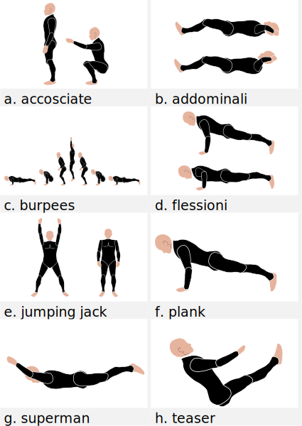

== Elenco Esercizi

=== Corpo libero

((Accosciata))::  
    _Sinonimi_: ((air squat)), ((squat)) +
    Esercizio che prevede il passaggio dalla posizione eretta a quella accosciata: gambe flesse oltre i 90°, schiena eretta, peso sulla pianata del piede. Le braccia possono essere parallele al terreno o più sollevate. riferimento <<esercizi1, figura 1a>>

	varianti:::
	
	*** ((squat jump)): Esercizio adatto al rafforzamento delle gambe 
	*** Squat press
	*** Squat side to side
		1.  Scendo in squat con una delle due gambe in affondo laterale
		2.  Salto nella direzione opposta alla gamba in affondo
		3.  Atterro specularmente al punto 1

[[addominali]]
((addominali)):: Da supini flettere leggermente le gambe, portare le mani dietro la nuca e contrarre gli addominali,     senza che le mani spingano sulla testa. riferimento <<esercizi1, figura 1b>> + 
_Sinonimi_: ((abdominal crunches)), ((crunches))

	varianti:::
	* *((con peso))*: _Sinonimi_: ((Crunch with weight))
	* *((sit up))*: Si parte dalla posizione base dell'addominale con le braccia alzate (parallele al terreno) e si esegue raccogliendo le gambe e le braccia, portandosi in posizione seduta.

((affondo)):: ToDo +
    _Sinonimi_: ((Lunge))

((burpee))::  Il burpee è un esercizio full bodyfootnote:[https://it.wikipedia.org/wiki/Burpee]. riferimento <<esercizi1, figura 1c>>. Il movimento base si divide in 4 passaggi:
    . Partenza in posizione eretta
    . Si passa in posizione di squat con le mani a terra.
    . Si lanciano i piedi indietro tenendo le mani a terra.
    . Subito si riportano i piedi in posizione di Squat.
    . Si salta dalla posizione di squat verso l'alto

    varianti:::
    
    *** _((burpee bastardo))_: eseguito con due
    flessioni dopo la fase di planc
    

((Corsa sul posto))::
    _Sinonimi_: ((High knees running))

((Criss Cross)):: 
    <<addominali, addominali>> fatti a ginocchia alte con le gambe a 90 gradi. Portare mani dietro la nuca. Si portano le ginocchia alternate al petto ruotando il busto per toccare le ginocchia con il gomito opposto. +
    _Zone Coinvolte_ : Core.
    Variazioni:::
    ** _((Criss Cross to Teaser))_: 3 movimenti di criss cross e si sta per un secondo in posizione <<teaser>>

((downdog to bridge))::
    Da Cane faccia in giù fino a ponte faccia all'aria. +
    Esercizio che coinvolge più fasce

((geko))::
    Quadrupedia, le ginocchia non toccano terra. Estendi braccio sinistro e gamba destra e viceversa.

[[flessione]]
((flessione)):: riferimento <<esercizi1, figura 1d>>
	_Sinonimi_: ((Push up))
	Esercizio che si esegue passando dalla posizione di <<plank, plank>> flettendo e distendendo le braccia

	Varianti:::
	** *((Around the clock push up))*
	** *((HandStand push up))*: Forget shoulder presses. If you want a killer shoulder workout, look no further than the handstand push-up. To perform the handstand push-up, assume a handstand position. Slowly bend your elbows and lower your inverted body towards the ground. In order to maintain balance, you’re going to have to call on your core and other smaller stabilizing muscles. If you can’t do a stand-alone handstand, use a wall to assist you.
	** *((Hindu push up))*: footnote:[http://www.artofmanliness.com/2015/08/05/the-prisoner-workout/] This is a dynamic full-body movement that will build strength and flexibility in your chest, shoulders, back, hips, and triceps. +
	Get in position by standing with your feet slightly wider than shoulder-width apart. Bend down and place your hands on the floor while keeping your arms and legs straight. You should look like an upside down human “v” with your butt being the point of the “v” and your head pointing down to the ground. + 
	To perform the Hindu push-up, you’re going to make sort of a swooping motion with your body. Bring your head down and forward by bending your elbows. When your head gets close to the ground, continue moving your torso forward by arching your back and lowering your hips. Your hips will now be near your hands. Make sure to get a good stretch in your back. Return to the starting position and repeat. +
	** *((Cobra Push up))*: dalla posizione bassa della flessione portare il busto tutto a destra e tutto a sinistra e riflettere le braccia.
	** *((Push up and rotation))*
	** *((Spiderman push up))*: Push up con apertura alternata della gamba destra e della gamba sinistra nella fase di discesa. Il ginocchio della gamba divaricata cerca il gomito.
	** *((Stella marina))*: Dalla posizione di push up bassa a mani strette passare a quella a mani e piedi larghe con tre o quattro balzelli
	
todo eliminare immagini

((hip escape))::
    Quattro zampe, ginocchia vicine a terra. Far uscire la gamba sx dal lato destro vicina al terreno tenendo le ginocchia del dx vicine a terra.
    _Zone coinvolte_: Core

((Jumping Jack))::
    Esercizio che coinvolge gambe e un pò tutto il resto. riferimento <<esercizi1, figura 1e>> + 
    Varianti:::
        * con pesetti 

((Mountain climber))::
    dalla posizione di plank portare alternativamente le ginocchia al petto.

[[switch]]
((Switch)):: Esercizio adatto al rafforzamento delle gambe. Si parte dalla posizione dell'affondo e con un balzo ci si porta nella posizione opposta.

	Varianti:::
		* _((Switch Jump))_: Come lo switch ma ogni 3 switch un jump.
		* _((Switch Squat))_ Come lo switch ma ogni 3 switch uno squat.

[[plank]]
((Plank))::
    ottimo esercizio per il core. Posizione della <<flessione, flessione>> con le braccia tese. riferimento <<esercizi1, figura 1f>>
    
    varianti:::
    *** ((plank to teaser))
	*** ((plank walk))
        . Partenza in posizione plank
        . Piego il braccio destro e appoggio il gomito destro al terreno
        . Piego nello stesso modo il sinistro.
        . Fletto il braccio sinistro e lo riporto in appoggio sulla mano
        . Fletto come nel punto 4 anche il destro
        . Ricomincio dal punto 1 ma inverto il braccio che per primo scende.
    *** ((side plank)): Come il plank ma con il busto perpendicolare al terreno sorreggendosi su un braccio od un gomito.

((Plank to teaser)):: 
    Esercizio dinamico che si fapassando dalla posizione di <<plank, plank sui gomiti>> a quella di <<teaser>>

((Power cobra))::
    Esercizio dinamico che comporta il passare in maniera alternata dalla posizione del cobra a quella accosciata.

((Trazioni))::
	_Sinonimi_: ((Pull up)) +
	Esercizio di trazioni alla sbarra. Nel crossfit ha un'esecuzione con slancio che permette la realizzazione di più serie.

((Rollata))::
	_Sinonimi_: Roll up
	
	Varianti:::
	
	*** Rollata e jump: Rollata su tappetino e jump

((Rollè alto)):: Quadrupedia, le ginocchia non toccano terra. Rolle su braccio sinistro e gamba destra. Ruotare fino ad avere il torso in alto e toccare il piede in alto con la mano libera.

((Step up onto chair))::
	salire e scendere da una sedia.

[[superman]]
((superman)): Da stesi pancia in giù, contrarre braccia e gambe per ottenere la posizione tipica di superman. riferimento <<esercizi1, figura 1g>>

[[teaser]]
((teaser)):: stare a 'V'. riferimento <<esercizi1, figura 1h>>

((Triceps dip on chair)):: tricipiti da una sedia

((Wall sit)):: schiena appoggiata al muro e stare come da seduti

[[esercizi1]]

.alcuni esercizi: a. ((accosciate)), b. ((addominali)), c. ((burpees)), d. ((flessioni)), e. ((jumping jacks)), f. ((plank)), g. ((superman)), h. ((teaser))

		
=== Con ((Bilanciere)) (((barbell)))

Seguono descrizioni di esercizi da fare con il bilanciere

Clean:: Esercizio in 4 step. 
    . Partenza 
        ** chinati con le mani che afferrano il bilancere 
        ** schiena leggermente inarcata.
        ** peso bilanciato sotto i piedi.
        ** sguardo in alto
        ** testa allineata ala schiena
        ** bilanciere a contatto con gli stinchi
    . Stacco
        ** Spingi i piedi contro il terreno, tira indietro le ginocchia perchè il bilanciere muovendosi solo verso l'alto passi, sempre stando vicino al corpo..
        ** Lo stacco avviene lentamente e culmina in un movimento esplosivo con la piena estensione della schiena.
        ** Come la barra passa sopra le ginocchia, tieni il peso sui talloniil più possibile e comincia ad estendere le anche avanti
        ** Quando la barra arriva a mezza altezza, velocemente e con potenza estendi le anche, le ginocchia, le anche, i talloni. +
        Quando la barra prende inerzia solleva anche le spalle più velocemente possibile.
        La barra dovrebbe raggiungere la parte alta dei fianchi o del torace.
    . Atterraggio
        ** Appena cìè la completa estensione delle anche, porta il corpo sotto la sbarra, atterrando solidamente in front squat con lo sguardo in avanti. +
        Mentre lo fai ruota i gomiti avanti e sotto la barra, mollando la presa e permettendo ai polsi di girarsi verso l'alto. Fai posare la barra di fronte alle spalle, tra il picco dei deltoidi e la gola
    . Finale
        ** una volta che la barra è stabile, lentamente alzati fino alla posizione eretta. Se il peso è molto forte può essere più facile "rimbalzare" dalla posizione di squat senza pausa nella posizione bassa
    . Abbassate o Mollate il peso in sicurezza
    
    Varianti::: 
        * _((clean press))_ +
         come il clean ma si completa con un push press
        * _((power clean))_ +
        variazione del punto 3: ferma la barra a mezzo squat. Questa versione necessita che la barra sia lanciata più in alto.
        

((front squat))::
    Accosciata con il bilanciere appoggiato al petto.
    
((Renegade))::
	_Sinonimi_: ((remata))
	<<plank, plank>> remando con due pesi

.Esercizi aggiuntivi:
|===
| Corsa sul posto | Lunge
| Mountain Climber 
| Side Plank
| Step up into a chair
| Triceps dips on chair
| Wallsit
|===

.Push Ups
|===
| Push UPs 
| Around the Clock push up 
| Handstand push up
|===

[[bilancere]]
.((bilanciere))
|===
| Clean
| Front Squat
| Hindu Push ups
|===

[[kettlebell]]
.((kettlebell))
|===
| Renegade
|===

.((manubri))
|===
| Renegade
|===

