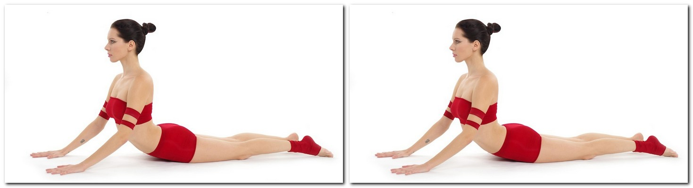
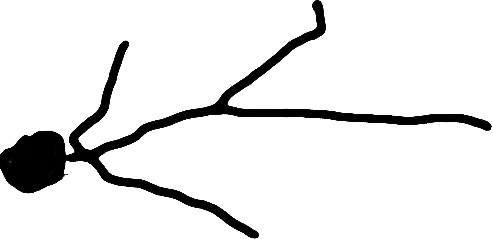
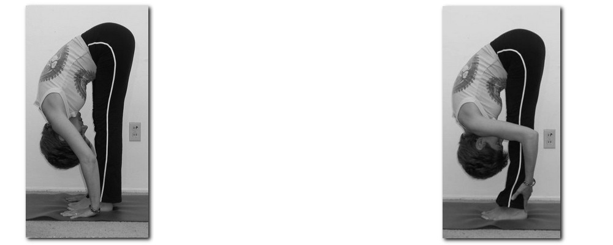
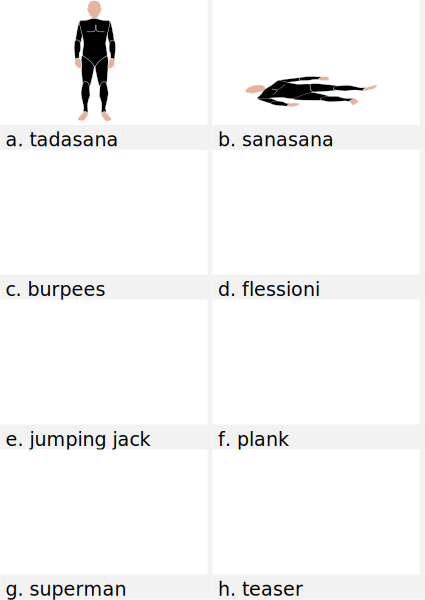
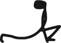

=== ((Asana)) ((Yoga))

Ecco un elenco delle (((posizioni yoga))) più comuni:

((cane a faccia in giù))::
    Sinonimi: _((Downward-facing dog))_, _((Adho Mukha Svanasana))_ +
    _Esecuzione_: Portando il peso sulle braccia, estendere le gambe alzando il bacino. Mantenere le piante dei piedi ben a terra. Inserire la testa tra le braccia, formando un triangolo con la schiena e le gambe ben dritte. +
    _Effetti_: La posizione ha lo scopo di allungare la schiena e fortificare le braccia e le gambe.
    
.adho mukha

[[bhujangasana]]
((cobra)):: 
    sinomimi: _((bhujangasana))_, _((serpente))_. +
    _Esecuzione_: Partendo dalla posizione prona, con il corpo disteso sulla pancia e le gambe unite e parallele con le cosce al suolo e piedi distesi e allungati sul dorso, si piegano le braccia portando i palmi delle mani a terra all'altezza delle spalle. Inspirando, si solleva il busto con le braccia, distendendole, mantenendo cosce e pube a contatto con il suolo. Questa versione è detta Raja Bhujangasana +
    _Effetti_: rinforza i muscoli dorsali, promuove la flessibilità della colonna vertebrale e stimola la circolazione sanguigna nella regione spinale tonificando i plessi nervosi. Gli effetti di questo âsana interessano tutte le vertebre: una pratica attenta e costante permette la correzione di eventuali deviazioni della colonna vertebrale. Bhujangâsana risulta particolarmente efficace nell'affrontare dolori e irregolarità mestruali, costipazione e lombaggine. Vengono stimolati tutti gli organi addominali, in modo particolare il fegato e i reni. E' considerato un ottimo esercizio per la preparazione al parto, anche se non deve essere eseguito durante il periodo della gravidanza. footnote:[Fonte: http://www.yoga.it/articoli/bhujangasana-il-cobra/]

.cobra footnote:["Bhujangasana Yoga-Asana Nina-Mel" by Kennguru - Own work. Licensed under CC BY 3.0 via Commons - https://commons.wikimedia.org/wiki/File:Bhujangasana_Yoga-Asana_Nina-Mel.jpg#/media/File:Bhujangasana_Yoga-Asana_Nina-Mel.jpg]

((savasana))::
    sinonimi: _((Posizione del cadavere))_, ((Mrtasana))_ +
    Savasana è una posizione di rilassamento totale, quindi anche una delle asana più impegnative.
    

     
((uttanasana)):: 
    _Sinonimi_: ddd
    
.uttanasana footnote:["Fb1" by The original uploader was Nemonoman at English Wikipedia - Transferred from en.wikipedia to Commons by IngerAlHaosului using CommonsHelper.. Licensed under GPL via Commons https://commons.wikimedia.org/wiki/File:Fb1.jpg#/media/File:Fb1.jpg]

[[asana1]]

.alcuni esercizi: a. ((tadasana)), b. ((savasana)), c. ((xx)), d. ((xx)), e. ((xx)), f. ((xx)), g. ((xx)), h. ((xx))

=== Sequenze Yoga

.Saluto al sole
[cols="1,3"]
|===
|  | Posizione della preghiera: ((Pranamasana)) espirare con i piedi uniti e le mani giunte davanti al petto.
|  | Posizione delle mani sollevate: ((Hasta uttanasana)) inspirare distendendo le braccia verso l’alto e flettendo il tronco all’indietro.
|  | Posizione delle mani ai piedi: (Padahastasana) espirare piegandosi in avanti partendo dai fianchi, fino ad appoggiare i palmi delle mani a terra ai lati dei piedi.
|  | Posizione equestre: (Ashwa sanchalanasana) Inspirare stendendo la gamba sinistra indietro; contemporaneamente piegare il ginocchio destro e guardare in alto sollevando il mento.
|  | Posizione del cane che guarda indietro: (Adho mukha svanasana) trattenere il respiro e portare il piede destro indietro, vicino al sinistro. Obiettivo è che il corpo formi una linea dritta.
|  | Saluto con gli “otto” arti del corpo: (Ashtanga namaskara) espirare portando a terra le ginocchia, il petto e la fronte, tenendo sollevati il bacino e lo stomaco.
|  | Posizione del serpente (o del cobra): (Bhujangasana) inspirare e guardare in alto, sollevando la parte superiore del corpo e le braccia.
|  | Posizione del cane che guarda indietro: (Adho mukha svanasana) espirare con le mani a terra, portando la punta dei piedi in avanti e spingendo le natiche verso l’alto e all’indietro.
|  | Posizione equestre: (Ashwa sanchalanasana) inspirare portando il piede sinistro tra le mani. Vi troverete con la gamba destra tesa all’indietro e il ginocchio poggiato a terra.
|  | Posizione delle mani ai piedi: (Padahastasana) espirare portando la gamba destra vicino alla sinistra e il bacino verso l’alto. Avvicinate il viso alle gambe.
|  | Posizione delle mani sollevate: (Hasta uttanasana) distendete le braccia in avanti, poi verso l’alto e oltre la testa, piegandovi all’indietro con le mani unite.
|  | Posizione della preghiera: (Pranamasana) chiudere il ciclo con la posizione numero 1.
|===
