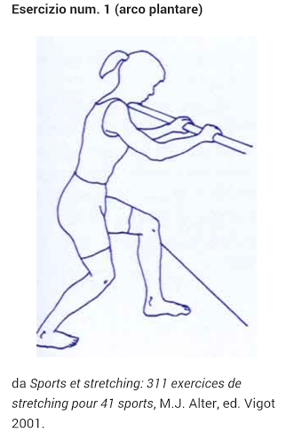
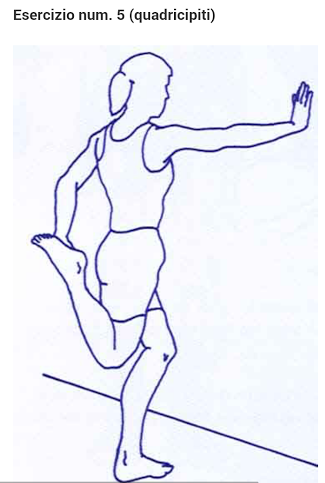
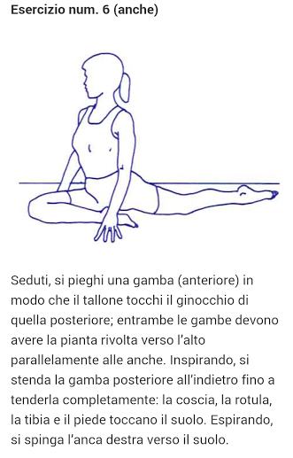
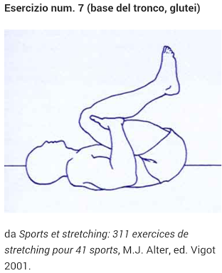
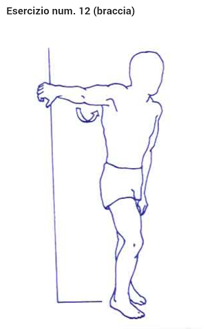

=== Esercizi stretching

==== Localizzazioni

===== Testa

-   inclina a destra e sinistra
-   circonvoluzione a destra e sinistra
-   ruota a destra e sinistra

===== Spalle

-   rotazione ed estensione dell'omero per ogni braccio

==== Stretching post running

Ecco 10 alcuni esercizi proposti da eseguire dopo una sessione di corsa footnote:[Il riferimento per questa citazione è andato perso, da recuperare. Reference for this citation must still be recovered]

image::figures/stretching/run02_gambe_posteriore.png[]

image::figures/stretching/run03_popliteo.png[]

image::figures/stretching/run04_adduttori.png[]

image::figures/stretching/run08_dorso.png[]

image::figures/stretching/run10_pettorali.png[]

image::figures/stretching/run11_spalle.png[]

